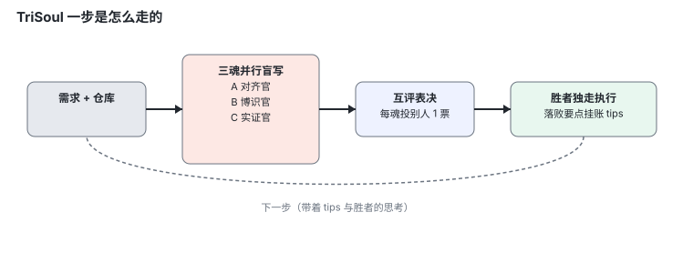
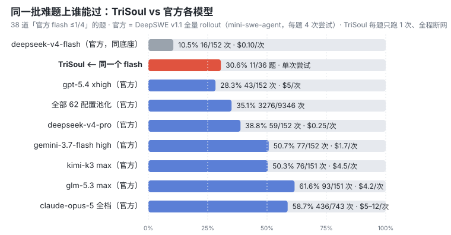
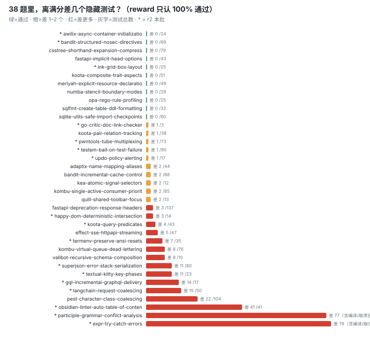
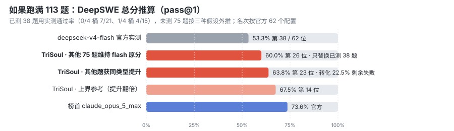

# TriSoul —— 三魂共识 Agent

> 基于 [DeepSeek Harness](https://github.com/deepseek-ai/deepseek-harness)（`dsh`）的插件套件。
> 一条命令装好，跑在自己的目录和端口上，**不碰你已有的 `~/.dsh`**；不想要了一条命令删干净。

**v0.1 · 半成品，拿来玩玩可以，别拿来干正事。** 先把下面的[风险提示](#风险提示)读完再装。

---

## 它是什么

普通 agent 是一个模型自己想、自己写、自己交。TriSoul 把这一步拆成三份并行：

### 1. 三魂共识

同一份上下文同时发给三个「灵魂」盲写（互相看不见对方的稿子），写完**匿名互评**——
每个灵魂只能投别人的票、不能投自己，胜者带着落败稿里的有用要点（tips）去执行。



三个灵魂是**同一个模型的三份实例**，区别在于各带一个「镜头」。这一层叫**三官**，
每官四档（关 / 轻 / 标准 / 猛），档位调的是提示词压强，不是功能开关：

| 官 | 管什么 | 干的事 | 专属工具 |
|---|---|---|---|
| **对齐官** `align` | 做什么 | 逐字对照用户要求与产出，抓被「差不多」带过去的缩水与偷换 | `task_original`（取回用户逐字原话，对抗压缩后的转述漂移） |
| **博识官** `erudite` | 凭什么做 | 查证现状与参照，把「我记得」逼成有出处的事实，未知列清单 | `web_search` / `web_fetch` |
| **实证官** `empiric` | 做对没有 | 让现实验证结论，验过没验过分开说，推理踩现实锚点 | `run_verify`（`node --check` / `tsc --noEmit`，只读检查，从不执行你的代码） |

立论是：**弱模型的病在生成时穷**——顾一头就丢其他。所以补偿要发生在**生成阶段**
（三个镜头各写一份完整稿），而不是对一份穷稿做事后质检。

> 本发行版默认三官全开「猛」档，和下面那轮评测同配置。
> 嫌贵可以在网页「设置」里降档，或整栏关掉——关掉后三个灵魂退回旧人设（求稳 / 求成 / 求全）。

### 2. 画布式上下文

不按「新旧」自动截断对话。上下文分成恒真区 / 状态区 / 工作区，
由一个读得懂内容的「手术刀」圈定区间改写，改完还要做探针题验收。

### 3. 记忆中枢

独立的模型订阅事件流，自动消化沉淀成记忆；推（开场注入）、拉（`trisoul_recall`）、
手术后回捞三条通道。

装上以后你看到的还是 dsh 原来的网页，只是多了「监控」「记忆」两个标签页和设置里的 TriSoul 分区。

---

## 跑分

### 怎么测的

[DeepSWE](https://deepswe.ai/) 是一套让前沿大模型也只能做对七成的编程题库，官方公开了
62 个「模型 × 推理强度」配置在 113 道题上的全部 28010 次运行记录。

我们从中挑出**官方 `deepseek-v4-flash` 通过率 ≤ 1/4 的 38 道题**（其中 17 道是 0/4 四连败），
用 TriSoul 驱动**同一个 flash 模型**再跑一遍。全程断网、每题只跑一次、不看答案。

### 结果



| | 通过率 | 口径 |
|---|---|---|
| `deepseek-v4-flash` 官方（同底座） | **10.5%** | 16/152 次尝试 · $0.10/次 |
| **TriSoul（同一个 flash）** | **30.6%** | **11/36 题 · 每题只跑 1 次** |
| `gpt-5.4 xhigh` 官方 | 28.3% | 43/152 次 · $5/次 |
| `deepseek-v4-pro` 官方 | 38.8% | 59/152 次 · $0.25/次 |
| `claude-opus-5` 全档 官方 | 58.7% | 436/743 次 · $5–12/次 |

三件可以直接说出口的事：

- **同一个模型，架构带来 2.9 倍。** 官方 flash 在这 38 题上 152 次尝试只过了 16 次；
  TriSoul 用同一个 flash、每题一次机会，36 题过了 11 题。
- **两道 Opus 5 官方 20 次尝试 0 通过的题（`awilix`、`meriyah`），TriSoul 过了。**
  另有 `ink-grid`（Opus 5 仅 2/20）、`csstree`（2/20）、`bandit-structured`
  （3/20，全场 62 个配置池化通过率仅 7%）。
- **近失很多。** DeepSWE 只认隐藏测试 100% 通过。除 11 题满分外，还有 10 题只差 1–2 个测试。



### 表决数据

183 轮表决的全景统计：

- **胜者分布均衡**：A 54 / B 43 / C 52（36% / 29% / 35%），没有哪个灵魂垄断。
- **平票率 18.6%**（34/183），上一轮是 17.9%——两批几乎一致，是结构性现象不是偶然。
  平票按轮次轮换定胜者，轮换落点 12/11/11 也是均匀的。
- 因为投票者只看别人的稿，**单候选票数上限是 2**，数学上不可能出现 3-0。
  **2-1 就是这套架构里最强的共识信号**，「全票通过」不存在。

一个具体例子：`pwntools` 第 9 步，一个灵魂想通过改弱测试绕开尚未修好的死锁，
另外两票精确点名 "weakens test_accept_closed … to dodge the bug"，2:0 否决。

### 如果跑满 113 题（推算）



只跑了 flash 做不好的 38 题，剩下 75 题按假设外推：

| 假设 | 113 题总分 | 榜上位置 | 同档 |
|---|---|---|---|
| flash 官方基线 | 53.3% | 第 38 / 62 | — |
| 其他题分数不变 | **60.0%** | 第 26 | `gpt-5.6-terra xhigh`（60.2%） |
| 其他题获同类型提升 | **63.8%** | 第 23 | `gpt-5.5 high`（64.4%）、`deepseek-v4-pro max`（62.8%） |

榜首 `claude-opus-5-max` 是 73.6%。（这三行是推算不是实测，仅作参考。）

### 口径

这 38 题是按「官方 flash 表现差」挑的，TriSoul 每题只跑 1 次、官方每题 4 次，
所以上面对比用的是「平均每次通过率」（pass@1），不是「四次里至少过一次」（pass@4）。

### 完整报告

**[→ TriSoul × DeepSWE：用一个小模型，做到接近大模型的事](https://gulagala001.github.io/dsh-trisoul/deepswe-report.html)**

含逐题转胜分析（awilix / bandit-structured / ink-grid 三个故事）、表决全景、
断网与作弊面审计、全量推算的完整算法。也可以直接下载
[`docs/deepswe-report.html`](docs/deepswe-report.html) 本地打开——单文件、无外链、无脚本。

---

## 安装

**前置**：Node.js ≥ 20、pnpm。没有 pnpm 就先装一个：

```bash
npm i -g pnpm
```

然后：

```bash
npx github:gulagala001/dsh-trisoul init
npx github:gulagala001/dsh-trisoul start
```

`init` 会把宿主 dsh 和 TriSoul 插件装进一个独立目录（Windows 是
`%LOCALAPPDATA%\dsh-trisoul`，macOS / Linux 是 `~/.dsh-trisoul`），首次约 1~3 分钟。
`start` 起服务并打开浏览器，默认地址 **http://127.0.0.1:3081**。

最后一步：在网页里点 **设置 → 模型**，填一个 [DeepSeek API key](https://platform.deepseek.com/)，保存即用。
key 存在你自己的安装目录里，页面不会回显明文。

> 没有 `git` 的机器上 `npx github:` 会失败，改用 [Releases](https://github.com/gulagala001/dsh-trisoul/releases)
> 里的压缩包，解压后在目录里跑 `node cli/index.mjs init`。

---

## 用法

```bash
npx github:gulagala001/dsh-trisoul <命令>

  init        安装（首次）
  start       启动并开浏览器
  stop        停止
  restart     重启（有任务在跑时会拒绝，除非 --force）
  status      看状态
  log [n]     看最后 n 行日志
  doctor      重打上游补丁 + 自检
  uninstall   卸载
```

常用选项：`--port <n>`（默认 3081）、`--cwd <目录>`（Agent 的工作目录，默认是你当前所在目录）、
`--no-open`（不自动开浏览器）、`--force`。

想让它在某个项目里干活，就在那个项目目录下 `start`，或者 `start --cwd /path/to/project`。

---

## 这个仓库里有什么

```
cli/            安装器与启停命令（零第三方依赖，直接 node 跑）
  index.mjs       命令分发入口
  lib/init.mjs    装宿主 dsh → 复制插件 → 装配 profile → 打上游补丁 → 自检
  lib/server.mjs  start / stop / status / restart（Windows 走 taskkill，POSIX 走信号）
  lib/uninstall.mjs  卸载（带路径安全围栏，拒绝删 $HOME、~/.dsh 这类目录）
  lib/patch-pi-ai.mjs  给上游 pi-ai 打一个 O(n²) 性能补丁，可用 doctor 重打

config/
  trisoul.patch.yml  profile 配置模板：挂哪些插件、三魂人设、三官档位、模型路由

packages/       TriSoul 插件本体（服务端 6 个 + 客户端 3 个）
  dsh-plugin/     三魂共识：盲写 / 匿名表决 / tips 挂账 / 平票轮换
  dsh-canvas/     画布式上下文：恒真区 / 状态区 / 工作区的分区与触发
  dsh-surgeon/    上下文手术刀：圈定区间改写 + 探针题验收
  dsh-memory/     记忆中枢：事件流消化、推 / 拉 / 回捞三通道
  dsh-guard/      安全门：共识 ≠ 授权，三个灵魂一致同意的危险动作照样拦
  dsh-api/        Web UI 的后端接口 + 三官档位解析 + 监控归因
  client/memory-ui、client/monitor、client/settings   三个网页插件（预构建产物）

docs/           README 里的图表 + 完整评测报告（单文件 HTML）
```

装完以后东西都在安装目录里，和这个仓库无关：

```
~/.dsh-trisoul/          （Windows：%LOCALAPPDATA%\dsh-trisoul）
  host/     独立安装的 dsh 宿主
  app/      TriSoul 插件副本
  home/     DSH_HOME：profile、设置、会话、你填的 key
  data/     记忆库、会话绑定
  logs/     日志与 pid
```

---

## 卸载

```bash
npx github:gulagala001/dsh-trisoul uninstall              # 删干净
npx github:gulagala001/dsh-trisoul uninstall --keep-data  # 先把记忆库和会话备份到 ~/trisoul-data-backup
```

会先停掉服务，再删掉整个安装目录（宿主 dsh、插件、profile、记忆、日志、你填的 key 都在里面）。
**你原有的 `~/.dsh`、原版 dsh 的配置和会话一律不动**，系统里也没有别的残留。

---

## 风险提示

这套架构是拿准确率换资源的，代价很实在，装之前请知悉：

| 风险 | 说明 |
|---|---|
| **输入暴涨** | 三个灵魂各自吃一份完整上下文，输入 token 至少 ×3；三官开「猛」档时每魂还要多背一份上千字符的人设；再加上记忆中枢和手术刀的后台调用，**账单比单模型高一个量级**是常态。先用小额度试，嫌贵先把三官降档。 |
| **缓存命中差** | 三个灵魂人设、温度各不相同，每轮盲写又要重组上下文，prompt 缓存很难命中，省不下这部分钱。 |
| **并发限制** | 三路盲写并行，外加后台的记忆消化和上下文手术，很容易撞上 API 的并发/限流上限。撞上了表现为变慢、报错或某个灵魂掉线（会降级到 2/3 继续）。 |
| **结果不稳定** | 共识机制不保证每次都收敛到同一答案：同样的问题问两次可能给出不同方案。平票时（实测约 18.6% 的轮次）有轮换兜底，但那不是「更对」，只是「有个结果」。 |
| 只能本机用 | 服务默认只绑 `127.0.0.1`，接口没有鉴权，**不要暴露到公网**。 |
| 模型得会输出 JSON | 盲写协议要求模型稳定输出 JSON，做不到的渠道不适配。 |
| 还是半成品 | 宿主 dsh 自己也标着 developer preview，会有破坏性变更；本项目钉死在一个已知能跑的版本上。 |

---

## 和原版 dsh 的关系

- 全部功能都以 dsh 插件形式实现，宿主一行没改；两个上游依赖的补丁在安装时自动打（`doctor` 可重打）。
- 装在独立目录、独立端口（3081，原版默认 3080），和你已有的 dsh 互不影响，可以同时开着。
- 宿主 dsh 是 [MIT](https://github.com/deepseek-ai/deepseek-harness) 协议的开源项目，本项目同样 MIT。

## 许可证

[MIT](LICENSE)
